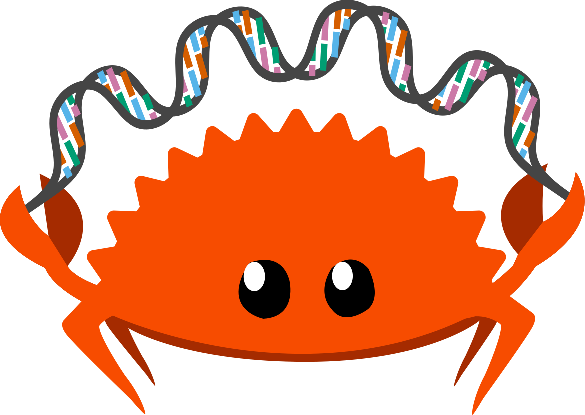

#  Rust-Bio, a bioinformatics library for Rust.

This library provides [Rust](https://www.rust-lang.org) implementations of algorithms and data structures useful for bioinformatics.
All provided implementations are rigorously tested via continuous integration.

**Please see the [API documentation](https://docs.rs/bio) for available features and examples of how to use them.**

When using Rust-Bio, **please cite** the following article:

[Köster, J. (2016). Rust-Bio: a fast and safe bioinformatics library. Bioinformatics, 32(3), 444-446.](http://bioinformatics.oxfordjournals.org/content/early/2015/10/06/bioinformatics.btv573.short?rss=1)

Further, you can cite the used versions via DOIs:

Rust-Bio: 

## Contribute

Any contributions are welcome, from a simple bug report to full-blown new modules:

If you **find a bug** and don't have the time or in-depth knowledge to fix it, just [check if you can add info to an existing issue](https://github.com/rust-bio/rust-bio/issues) and otherwise [file a bug report](https://github.com/rust-bio/rust-bio/issues/new/choose) with as many infos as possible.
Pull requests are welcome if you want to contribute fixes, documentation, or new code. Before making commits, it would be helpful to first install `pre-commit` to avoid failed continuous integration builds due to issues such as formatting:
1. Install `pre-commit` (see [pre-commit.com/#installation](https://pre-commit.com/#installation))
2. Run `pre-commit install` in the rust-bio base directory

Depending on your intended contribution frequency, you have two options for opening pull requests:
1. For one-time contributions, simply [fork](https://help.github.com/en/github/getting-started-with-github/fork-a-repo) the repository, apply your changes to a branch in your fork and then open a pull request.
2. If you plan on contributing more than once, become a contributor by saying hi [on the `rust-bio` Discord server](https://discord.gg/rssQABT),
    Together with a short sentence saying who you are and mentioning what you want to contribute.
    We'll add you to the team.
    Then, you don't have to create a fork, but can simply push new branches into the main repository and open pull requests there.

If you want to contribute and don't know where to start, have a look at the [roadmap](https://github.com/rust-bio/rust-bio/issues/3).

### Documentation guidelines

Every public function and module should have [documentation comments](https://doc.rust-lang.org/stable/rust-by-example/meta/doc.html).
Check out [which types of comments to use where](https://doc.rust-lang.org/stable/reference/comments.html#doc-comments).
In `rust-bio`, documentation comments should:
* [explain functionality](https://doc.rust-lang.org/rustdoc/how-to-write-documentation.html)
* give at least one useful example of how to use it (best as [doctests](https://doc.rust-lang.org/rustdoc/documentation-tests.html),
  that run during testing, and using descriptive [`expect()`](https://doc.rust-lang.org/std/result/enum.Result.html#method.expect)
  statements for handling any `Err()`s that might occur)
* describe time and memory complexity listed (where applicable)
* cite and link sources and explanations for data structures, algorithms or code (where applicable)

For extra credit, feel free to familiarize yourself with:
* the Rust [documentation conventions](https://rust-lang.github.io/rfcs/1574-more-api-documentation-conventions.html#appendix-a-full-conventions-text)
* the Rust [API documentation guidelines](https://rust-lang.github.io/api-guidelines/documentation.html)

## Minimum supported Rust version

Currently the minimum supported Rust version is 1.65.0.

## License

Licensed under the MIT license http://opensource.org/licenses/MIT. This project may not be copied, modified, or distributed except according to those terms.
